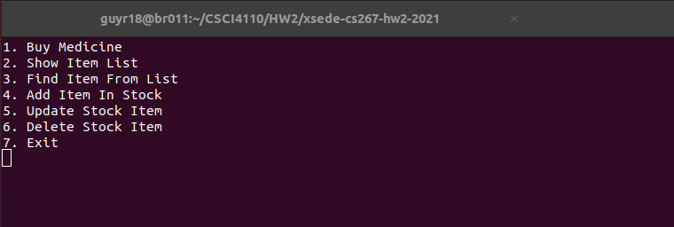
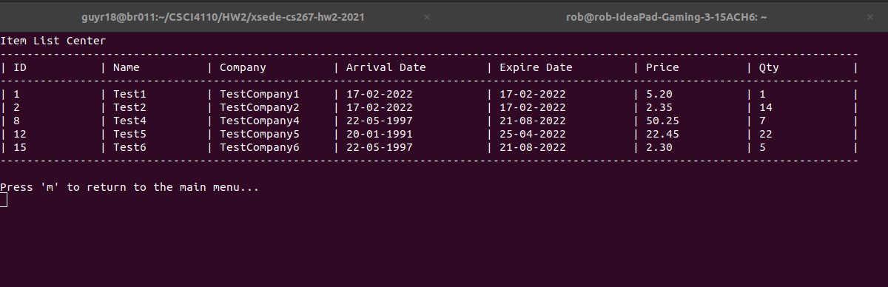

# Pharmacy Management System
<p>
  
   
</p>

# Purpose
Pharmacy Management System is a command-line application that is being developed to
handle the inventory management of medicinal products at local pharmacist location.

Three primary reasons for its development are as follows:
- To immerse myself in the Boost C++ Library
- To gain educational experience with back-end integration in C++
- To refine my knowledge of OOP in C++; abstract classes, virtual methods, and more

# Requirements
In order to run this application, it is recommended that you install the following
third-party libraries and/or dependencies on your local machine:

- Boost 1.71.0 or higher
- PGAdmin 4 6.4 or higher
- PostgreSQL 14.2 or higher
- GCC 9.3 or higher
- Libpqxx 7.1.1 or higher

Libpqxx 7.1.1 utilizes functionality that requires C++ 17 or higher. Therefore, it is
recommended to compile using C++ 17 at a minimum.

# Preparing to Compile
There are two additional steps that are required to compile this application. 
  (1) Export **medicine_schema.sql** inside PGAdmin.
  (2) Update **psql_config.conf** so that it is consistent with your database configuration.
      
Failure to complete these steps will result in additional exceptions. The first step is self
explanatory, however I will briefly explain step (2) below. **psql_config.conf** contains
several lines that handle database configuration, respectively. They are formatted as the following:

```
<field_name>=<field_value>
```
This application expects <field_name> to remain unchanged. Failure to do so, will result in a
configuration error when starting this application. Conversely, <field_value> should be updated
to correspond to your database server settings.

# Compiling this Application
This application has only been tested under the G++ compiler. Furthermore, In order to compile 
this application, you will also need to link the Libpqxx libraries. The compiler flags used for 
this are as follows:

```
-lpqxx -lpq
```
The full command line statement that you should issue will follow the following format (assuming you are in the root directory):

```
g++ Main.cpp -lpqxx -lpq -o Main
```
Subsequently you may run the executable as: **./Main**
Conclusively, it is possible you may encounter permission-based errors if you are not an adminstrator or super-user on your local machine.
To address this on a Linux or Unix based machine, you may use the chmod command on the yielded executable:

```
chmod +x Main
```
